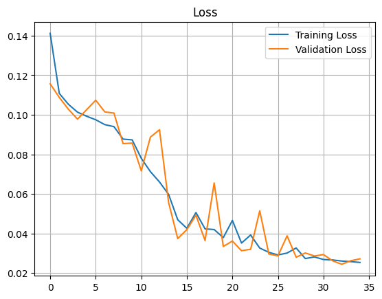

# Noisy-and-Low-Light-Image-Enhancement-with-CNN

Welcome to the repository for the Noisy and Low Light Image Enhancement System project. The primary goal of this project is to develop a robust computer vision system capable of enhancing low light and noisy images. The system targets specific regions of interest (ROIs) within input images, improving visual quality and overall image aesthetics.

## Project Overview

The core objective of this project is to create a system that takes dark and noisy images as input and produces enhanced ROIs that are visually appealing and of higher image quality. This enhancement process is achieved through a combination of image processing and deep learning techniques. The system is designed to handle images of varying sizes and resolutions, making it versatile for various real-world applications.

## Model Performance

The heart of the system is a Convolutional Neural Network (CNN) based model. This model has been carefully designed and fine-tuned to excel in enhancing low light and noisy images. During validation, the model demonstrated impressive results, achieving a PSNR (Peak Signal-to-Noise Ratio) value of 29.3488 and an SSIM (Structural Similarity Index) of 0.9298. These metrics underscore the model's ability to significantly enhance image quality.

## Interactive Web App

To showcase the capabilities of the developed model, an interactive web app has been created using Streamlit. This app allows users to upload their own low light images and witness the enhancement process in real-time. It provides an intuitive and user-friendly interface for leveraging the power of the image enhancement system.

# Folder Structure

The repository is organized as follows:

- `Notebook Experiments/`: This directory contains the Jupyter notebooks used for conducting various experiments and analyses.

## Loss Function and Training Visualization

In the `Notebook Experiments/` directory, you will find the notebook named "With_MS_SSIM_L1__Add_model.ipynb." This notebook showcases the training and validation process of the model with the Multi-scale SSIM plus L1 loss function.

The above image illustrates the training and validation loss curves. The curve provides insight into the convergence and performance of the model during training.

## Loss Function Details

The loss function utilized in this project, Multi-scale SSIM plus L1 loss, is inspired by the paper titled "Loss Functions for Image Restoration with Neural Networks" by Hang Zhao, Orazio Gallo, Iuri Frosio, and Jan Kautz. [https://arxiv.org/pdf/1511.08861.pdf] This loss function combines the structural information preservation capabilities of Multi-scale SSIM with the pixel-wise L1 loss component, resulting in a holistic measure that ensures both perceptual and pixel-level fidelity in image restoration tasks.

Feel free to explore the notebook for more in-depth analysis and insights related to the model's performance and the impact of the chosen loss function.

The design inspiration for this project comes from the paper "LLCNN: A Convolutional Neural Network for Low-Light Image Enhancement." [https://ieeexplore.ieee.org/document/8305143] This work builds upon the concepts presented in the paper while applying them to real-world scenarios.

